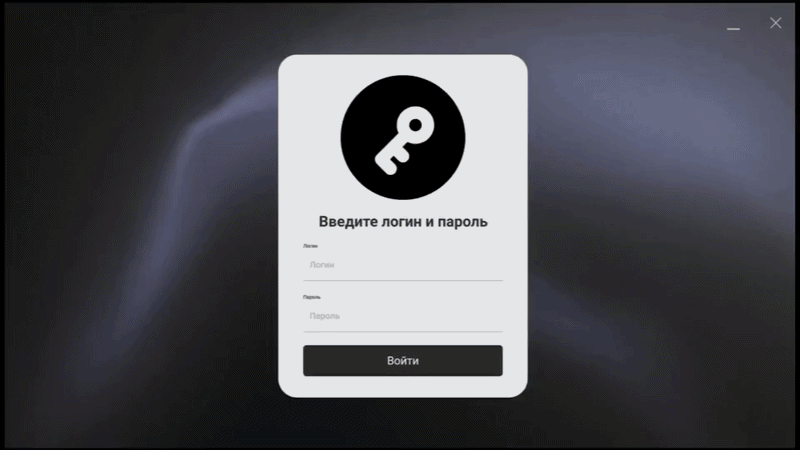

# Система распознавания маркировки (Python + Node.js)


Проект представляет собой локальный сервис для автоматического распознавания текста маркировки с изображений металлических изделий и отправки данных на удаленный сервер (Node.js) для дальнейшей обработки в 1С.

## Архитектура

1. **YOLOv8**: Нейросеть для поиска области с маркировкой на изображении.
2. **PaddleOCR**: Распознавание текста в найденной области с адаптивной предобработкой.
3. **Modular Structure**: Код разделен на логические модули (детекция, распознавание, API, парсинг).
4. **Stream Mode**: Сервис, работающий в фоне. Следит за папкой `data/input`, обрабатывает файлы и отправляет результаты на сервер.

---

## Установка

### 1. Требования

- Python 3.13.
- Видеокарта NVIDIA (опционально, для ускорения YOLO).

### 2. Создание виртуального окружения

```bash
 # Windows
py -3.13 -m venv venv
.\venv\Scripts\activate
```

### 3. Установка зависимостей

#### 3.1. Рекомендованный метод установки:
```bash
pip install -r requirements.txt
```

#### 3.2. Поочередная установка
##### Базовые библиотеки

```bash
pip install ultralytics requests python-dotenv
```

##### PaddlePaddle и PaddleOCR (Стабильные версии)

```bash
pip install paddlepaddle==2.6.1 -i https://mirror.baidu.com/pypi/simple


pip install paddleocr==2.7.3
```

##### Фиксация совместимых версий OpenCV и Numpy

```bash
pip install numpy==1.24.3 opencv-python==4.6.0.66 --force-reinstall
```

##### Шифрование

```bash
pip install cryptography
```

### 4. Конфигурация

Создайте файл `.env` в корне проекта:

```env
KEY=
```

Сгенерируйте ключ шифрования и вставьте в .env файл
```python
from cryptography.fernet import Fernet

print(Fernet.generate_key())
```
---

## Запуск и проверка

### Шаг 1. Запуск сервера (Node.js)

Убедитесь, что ваш Node.js сервер запущен и доступен по порту из `.env`.

### Шаг 2. Запуск скрипта

Запуск осуществляется из корня проекта:

```bash
python src/main.py
```

В консоли появится сообщение: `Модели загружены! Начинаю слежение за папкой 'data/input'...`

### Шаг 3. Тестирование

1. Поместите изображение в папку `data/input/`.
2. Скрипт автоматически обработает его, отправит данные на сервер и переместит файл в `data/done/`.

### Результаты

В папке `data/output/` появятся:

- `filename_result.json` — полный технический ответ пайплайна.
- `filename_payload.json` — данные, отправленные на сервер.
- `filename_annotated.jpg` — фото с выделенной зоной маркировки.

---

## Структура проекта

```text
sorting-system-1c/
├── neural/                # Основной модуль распознавания
│   ├── src/               # Исходный код сервиса
│   │   ├── __init__.py
│   │   ├── main.py        # Точка входа, управление процессами
│   │   ├── pipeline.py    # Оркестратор (связывает YOLO и OCR)
│   │   ├── detectors.py   # Логика YOLO (поиск областей)
│   │   ├── recognizers.py # Логика OCR (чтение текста)
│   │   ├── parser.py      # Парсинг текста (регулярные выражения)
│   │   ├── api_client.py  # Сетевое взаимодействие (JWT)
│   │   ├── models.py      # Структуры данных (Data Classes)
│   │   └── utils.py       # Вспомогательные функции
│   │
│   ├── data/              # Рабочие данные
│   │   ├── input/         # Входящие изображения
│   │   ├── output/        # Результаты работы
│   │   └── done/          # Архив обработанных файлов
│   │
│   ├── runs/              # Результаты обучения моделей (веса)
│   ├── config.json        # Конфигурация моделей
│   ├──.env               # Переменные окружения 
│   └── extensions/            # Инструменты и утилиты
│       └── data_creator/      # Генератор синтетического датасета
│           ├── synt_data.py   # Скрипт аугментации и генерации
│           ├── run.py         # Запуск проверки изображения
│           ├── test_models.py    # Тестирование моделей
│           └── synthetic_dataset/   # Сгенерированные данные (train/labels)
│
├── server/               # Клиентская часть (если есть)
└── client/                # Клиентская часть (если есть)
```

---

## API Формат

Скрипт авторизуется на сервере (`/api/user/login`), получает JWT токен и отправляет данные в формате form-data` на `/api/service/scan`.

**Поля отправки:**

- `image`: Файл изображения.
- `serial_number`: Серийный номер (извлекается регулярным выражением `SN-...`).
- `batch_number`: Номер партии (извлекается регулярным выражением `B-...`).
---
# Сервер

Проектный сервер на Node JS. Желательно использовать Node JS v22.18.0 или новее

## Установка

1. Установите зависимости:
```bash
npm install
```
или просто
```bash
npm i
```

2. Создайте файл `.env` в папке server/

3. Настройте переменные окружения в файле `.env`:
```
DB_HOST=localhost
DB_PORT=5432
DB_NAME=    #Имя БД
DB_USER=postgres
DB_PASSWORD=    #Пароль БД

PORT=5000

ENCRYPTION_SALT=6fe1487911    #Случайные значения
JWT_PASSWORD_CODE=efdc97875ae97d75507b415902eabbc5
JWT_PASSWORD_DURATION=24

SCANNER_API_KEY=f01556be8df7176f45136c5289bc4c4f #API ключ для сканера
```

## Запуск

Запустить сервер в режиме разработки с автоматической перезагрузкой при изменении файлов:

```bash
npm run dev
```

Сервер будет доступен по адресу: `http://localhost:5000/api/`


## Структура проекта

```
server/
├── controllers/*                # Обработчики
├── database/
│   ├── database.js              # Подключение к базе данных
│   └── models.js                # Модели данных
├── error/                       # Обработка ошибок
├── middleware/*                 # Все используемые middleware
├── routes/
│   ├── router.js                # Главный роутер
│   └── ...                      # Маршруты
├── .env                         # Переменные окружения
├── index.js                     # Точка входа
├── package.json
└── package-lock.json
```

## Авторизация
Многие маршруты и WebSocket соединение защищены от неправомерных подключений при помощи JWT и API токенов.

**Вся авторизация проходит в заголовках HTTP запросов.**

Используются 2 различных сценария авторизации:
- Защищенные маршруты REST API и рукопожатие WebSocket соединения:
  - `authentification: 'Bearer JWT_TOKEN'` 
- Получение данных со сканера:
  - `authentification: 'SCANNER_API_KEY'`, переменная берется из .env файла 


## Основные скрипты

- `npm run dev` - запуск сервера в режиме разработки
- `npm i` - загрузка недостающих зависимостей


# Фронт
## Зависимости
- python. В теории версии с 3.11.x и выше. Работоспособность проверена на 3.14.3. Также необходимы следующие пакеты для работы и сборки
    - PySide6
    - pyinstaller
    - pillow
    - aiohttp
    - python-dotenv
    - platformdirs
- Qt6
## Запуск
Создайте файл `.env` в папке client/

3. Настройте переменные окружения в файле `.env`:
```
SERVER_URL=http://127.0.0.1
PORT=5000
```
Скорее всего, для генерации биндингов из питоновского кода необходимо запускать проект(и перед сборкой тоже) через в QtCreator.

После первого запуска можно стартовать через
```bash
python main.py
```
## Сборка
Метаданные по типу расположения иконки или названия произведенного бинарника находятся в [build_meta.env](./client/build_meta.env)
Сборка:
-    windows: [create_exe.bat](./client/create_exe.bat).
-    linux: [create_bin_linux.sh](./client/create_bin_linux.sh). На линуксе иконка бираника игнорируется
Сбилженный файл будет находится в [client/dist/$APP_NAME](./client/dist/)
## Структура проекта
```
client/
.
├── Components                     # Компоненты
├── Pages                          # Страницы
├── controller                     # Коммуникация между питоном(бэк) и фронтом
└── resources                      # Иконки, шрифты, задники
```