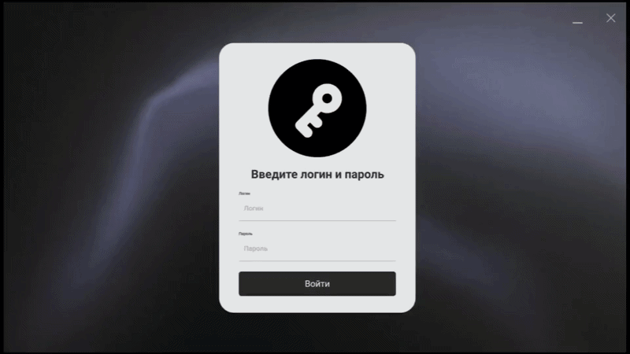

# Система распознавания маркировки (Python + Node.js)


Проект представляет собой локальный сервис для автоматического распознавания текста маркировки с изображений металлических изделий и отправки данных на удаленный сервер (Node.js) для дальнейшей обработки в системе 1С.

---
# Сервер

Проектный сервер на Node JS. Создано для Node JS v22.18.0 или новее

## Установка

#### Автоматическая установка (Windows)

1.  Откройте установочный файл `server/run-windows.bat`
2.  При первом запуске скорее всего выдаст ошибку подключения к базе данных.
3.  Откройте конфигурацию сервера `server/data/config.json` и измените параметры доступа к базе данных
4.  Повторно запустите файл `server/run-windows.bat`

#### Ручная установка

1.  Установите зависимости:
```bash
npm install
```
или просто
```bash
npm i
```

2.  Запустите программу 
``` bash
node index.js
```

3.  При первом запуске скорее всего выдаст ошибку подключения к базе данных.
4.  Откройте конфигурацию сервера `server/data/config.json` и измените параметры доступа к базе данных
5.  Повторно запустите программу

## Запуск

Запустить сервер в режиме разработки с автоматической перезагрузкой при изменении файлов:

```bash
npm run dev
```
либо в простом режиме
```bash
node index.js
```

**После сборки** создается минифицированный файл `server/dist/build.js`, запуск которого идентичен запуску основного приложения, но осуществляется внутри `server/dist`:

```bash
node build.js
```

Сервер будет доступен по адресу: `http://localhost:5000/api/`

## Настройка

После первого запуска любой версии создается директория `data`, а в ней файл `data/config.json`:

``` json
{
    "database": {
        "host": "",           // Адрес СУБД
        "port": "",           // Порт СУБД
        "name": "",           // Название базы данных
        "user": "",           // Пользователь, через которого будет доступ к БД
        "password": ""        // Пароль пользователя
    },
    "app": {
        "port": 5000          // Порт приложения
    },
    "encryption": {
        "salt": "",           // Соль для пароля
        "JWT_pass_code": "",  // Сид генерации JWT токена
        "JWT_duration": 24    // Продолжительность жизни токена в часах
    }
}
```

## Структура проекта

```
server/
├── controllers/*                # Обработчики
├── data/                        # Настройки приложения
├── database/
│   ├── database.js              # Подключение к базе данных
│   └── models.js                # Модели данных
│
├── dist/                        # Место сохранения минифицированной версии
├── error/                       # Обработка ошибок
├── middleware/*                 # Все используемые middleware
├── modules/*                    # Все вспомогательные модули приложения
├── routes/
│   ├── router.js                # Главный роутер
│   └── ...                      # Маршруты
│
├── index.js                     # Точка входа
├── package.json
└── package-lock.json
```

## Авторизация

Многие маршруты и WebSocket соединение защищены от неправомерных подключений при помощи JWT и API токенов.

**Вся авторизация проходит в заголовках HTTP запросов.**

Защищенные маршруты REST API и рукопожатие WebSocket соединения:
  - `authorization: 'Bearer JWT_TOKEN'` 

## Основные скрипты

- `npm run dev` - запуск сервера в режиме разработки
- `npm run build` - сборка минифицированной версии 
- `npm i` - загрузка недостающих зависимостей

---
# Клиент
## Зависимости

-  Требуется Python не ниже версии 3.11
-  Остальные зависимости прописаны в `client/requirements.txt`

## Установка

#### Автоматическая установка (Windows)

1.  Откройте установочный файл `client/run-windows.bat` и дождитесь запуска

#### Ручная установка

1. Создайте файл `.env` в папке client/
2. Настройте переменные окружения в файле `.env`:
```
SERVER_URL=http://127.0.0.1
PORT=5000
```

3. Создайте виртуальное окружение
``` bash
python -m venv venv
```

4. Активируйте виртуальное окружение
``` powershell
.\venv\Scripts\activate 
```
или
``` bash
source ./venv/bin/Activate
```

5. Установите зависимости
``` bash
pip install -r requirements.txt
```

6. Запустите программу
``` bash
python main.py
```

## Сборка

Метаданные расположения иконки и названия произведенного файла находятся в `/client/build_meta.env`

Сборка только через скрипты:
-    windows: `client/build-windows.bat`
-    linux: `client/create_bin_linux.sh` (на linux иконка игнорируется)

Готовый файл будет находится по пути `client/dist/`

## Настройка

Настройки приложения хранятся в файле `client/.env`:

```
SERVER_URL=http://localhost    // Адрес серверного приложения
PORT=5000                      // Порт серверного приложения
```

## Структура проекта

```
client/
├── Components                  # Компоненты
├── Pages                       # Страницы
├── controller                  # Коммуникация между питоном(бэк) и фронтом
└── resources                   # Иконки, шрифты, задники
```

---
# Нейросеть

## Зависимости

-  Требуется Python версии 3.13 (конкретно она)
-  Остальные зависимости прописаны в `client/requirements.txt`
-  Видеокарта NVIDIA (опционально, для ускорения YOLO)

## Установка

#### Автоматическая установка (Windows)

1.  Откройте установочный файл `neural/run-windows.bat` и дождитесь запуска

#### Ручная установка

1. Создайте файл `.env` в папке neural/
2. Настройте переменные окружения в файле `.env`:
```
KEY=
```

Сгенерируйте ключ шифрования и вставьте в .env файл

```python
from cryptography.fernet import Fernet

print(Fernet.generate_key())
```

3. Создайте виртуальное окружение
``` bash
python -m venv venv
```

4. Активируйте виртуальное окружение 
``` powershell
.\venv\Scripts\activate 
```
или
``` bash
source ./venv/bin/Activate
```

5. Установите зависимости
``` bash
pip install -r requirements.txt
```

6. Запустите программу
``` bash
python src/main.py
```

## Запуск и проверка

### Шаг 1. Запуск сервера (Node.js)

Убедитесь, что ваш Node.js сервер запущен и доступен по порту из `server/data/config.json`

### Шаг 2. Запуск скрипта

Запуск осуществляется из корня проекта:

```bash
python src/main.py
```

В консоли появится сообщение: `Модели загружены! Начинаю слежение за папкой 'data/input'...`
### Шаг 3. Тестирование

1. Поместите изображение в папку `data/input/`.
2. Скрипт автоматически обработает его, отправит данные на сервер и переместит файл в `data/done/`.
### Результаты

В папке `data/output/` появятся:
- `filename_result.json` — полный технический ответ pipeline.
- `filename_payload.json` — данные, отправленные на сервер.
- `filename_annotated.jpg` — фото с выделенной зоной маркировки.
## Структура проекта

```text
├── src/               # Исходный код сервиса
│   ├── __init__.py
│   ├── main.py        # Точка входа, управление процессами
│   ├── pipeline.py    # Оркестратор (связывает YOLO и OCR)
│   ├── detectors.py   # Логика YOLO (поиск областей)
│   ├── recognizers.py # Логика OCR (чтение текста)
│   ├── parser.py      # Парсинг текста (регулярные выражения)
│   ├── api_client.py  # Сетевое взаимодействие (JWT)
│   ├── models.py      # Структуры данных (Data Classes)
│   └── utils.py       # Вспомогательные функции
│
├── data/              # Рабочие данные
│   ├── input/         # Входящие изображения
│   ├── output/        # Результаты работы
│   └── done/          # Архив обработанных файлов
│
├── runs/              # Результаты обучения моделей (веса)
├── config.json        # Конфигурация моделей
├──.env               # Переменные окружения 
└── extensions/            # Инструменты и утилиты
    └── data_creator/      # Генератор синтетического датасета
        ├── synt_data.py   # Скрипт аугментации и генерации
        ├── run.py         # Запуск проверки изображения
        ├── test_models.py    # Тестирование моделей
        └── synthetic_dataset/   # Сгенерированные данные (train/labels)
```

## API Формат

Скрипт авторизуется на сервере (`/api/user/login`), получает JWT токен и отправляет данные в формате form-data` на `/api/service/scan`

**Поля отправки:**
- `image`: Файл изображения.
- `serial_number`: Серийный номер (извлекается регулярным выражением `SN-...`).
- `batch_number`: Номер партии (извлекается регулярным выражением `B-...`).